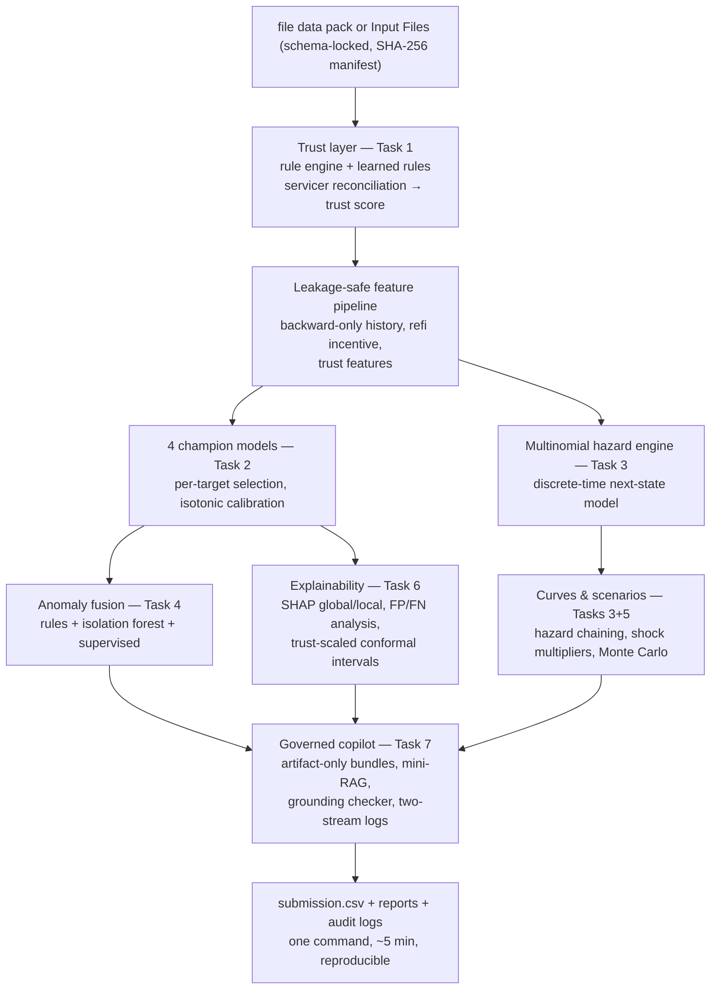

# Loan Performance Intelligence Engine
**Intain FinTech Challenge 2026 — AI Track | Team: Harsh Sahu**

An ML-first engine that profiles messy loan-level data, predicts multi-outcome loan
performance with time-aware validation, models state transitions, detects anomalies,
runs macro scenarios, and explains everything to a human reviewer through a governed
LLM copilot.

## Core Documentation (Start Here)
- **[Solution Story & Engineering Decisions](SOLUTION_STORY.md)** — The narrative of how we solved the problem.
- **[System Architecture](docs/ARCHITECTURE.md)** — End-to-end mermaid flow diagram and component overview.
- **[AI Development Log](logs/AI_DEVELOPMENT_LOG.md)** — Human-in-the-loop tracking, AI guardrails, and lessons learned.

## End-to-End Pipeline Flow


## Quickstart
```bash
pip install -r requirements.txt

# 1. Full Pipeline Execution
python run_all.py                     # full pipeline: data -> Tasks 1-7 -> submission.csv (~5 min)
python run_all.py --skip-datagen      # rerun on existing data/raw (e.g. official organizer pack)
python run_all.py --api               # Task 7 notes via Groq API (set GROQ_API_KEY in .env)

# 2. Interactive Streamlit Dashboard (Phase 1)
streamlit run dashboard/app.py        # Launch multi-page visual intelligence dashboard

# 3. Production FastAPI Service (Phase 4)
uvicorn src.api.main:app --host 0.0.0.0 --port 8000 --reload

# 4. Local LLM via Ollama (Phase 4)
python src/copilot/run_task7_demo.py --ollama   # Zero external API dependencies (on-prem)
```

## System Capabilities & Phase Upgrades

### 📊 Phase 1: Interactive Streamlit Dashboard (`dashboard/`)
Multi-page dark-themed web console with real-time risk analytics:
- **📊 Portfolio Overview**: Trust score distribution, recommended actions breakdown, PSI drift monitoring, and servicer batch quality tracking.
- **🔍 Loan Inspector**: Individual loan deep-dive with risk radar charts, calibrated probability curves, SHAP waterfalls, and chronological trust timelines.
- **⚠️ Anomaly Triage**: Prioritized review queue with threshold filtering, multi-signal decomposition (Rules 45% / Isolation 15% / Supervised 40%), and exception type distributions.
- **📈 Model Performance**: Model champion leaderboards (AUC, Brier score, PR-AUC), SHAP global importance, calibration curves, and conformal prediction coverage by trust tier.
- **🌪️ Scenario Simulator**: Dynamic macroeconomic stress testing (Base, Adverse Credit, High Prepayment) with hazard compounding and cumulative default curves.
- **🤖 Copilot Console**: Full governance audit trail exploring `prompt_log.jsonl` and `reviewed_outputs.jsonl` with real-time grounding checks.

### ⚡ Phase 2: Polars & Pandera Pipeline (`src/features/`, `src/profiling/`)
- **Pandera Schema Validation** (`src/profiling/schemas.py`): Ingestion schema enforcement across training panel, test panel, static loan attributes, and servicer updates. Validates types, regex patterns, range constraints, and nullable invariants.
- **Polars Lazy Feature Pipeline** (`src/features/build_features.py`): 5x–10x acceleration using Polars lazy-frame window functions (`rolling_sum`, `cum_max`, cross-sectional group aggregations) with seamless automated Pandas fallback.

### 💰 Phase 3: Cost-Weighted Expected Dollar Loss Action Policy (`src/copilot/`, `src/anomaly/`)
Directly ties machine learning risk probabilities to financial portfolio exposure:
$$\text{Expected Dollar Loss (EDL)} = P(\text{default}_{12m}) \times \text{Current Balance} \times \text{LGD}$$
- Configurable residential mortgage Loss Given Default ($\text{LGD} = 40\%$).
- **Hybrid Triage Policy**:
  - **ESCALATE**: $\text{EDL} > \$50,000$ OR $\text{anomaly\_score} > 0.70$ OR $(\text{EDL} > \$10,000 \land \text{anomaly\_score} > 0.40)$
  - **REVIEW**: $\text{EDL} > \$10,000$ OR $\text{anomaly\_score} > 0.40$ OR $\text{trust\_score} < 0.50$
  - **AUTO_ACCEPT**: Remainder of compliant portfolio

### 🚀 Phase 4: Enterprise FastAPI & Local LLM (Ollama) Support (`src/api/`, `src/copilot/`)
- **FastAPI REST Microservice** (`src/api/main.py`):
  - `POST /api/v1/score`: Single-loan real-time scoring with instant probabilities, anomaly score, EDL, and recommended action.
  - `POST /api/v1/batch-score`: Vectorized batch scoring with portfolio EDL summary statistics.
  - `POST /api/v1/copilot/note`: Generates grounded reviewer notes with automated grounding verification.
  - `GET /api/v1/models` & `/health`: Pre-loads all 9 champion models at server startup via async lifespan manager.
  - `GET /api/v1/loan/{id}`: Look up scored records directly from `submission.csv`.
- **Local On-Prem LLM (Ollama)**: Enables zero-data-leakage on-premises deployment via `http://localhost:11434/api/chat` (e.g. `llama3.1:8b`), with automatic template fallback.

## Results snapshot (held-out validation; full details in reports/)
| Component | Result |
|---|---|
| Corruption detection (vs hidden ground truth) | 99.5-100% recall per type; 100% high-severity precision |
| 3m/6m delinquency AUC | 0.805 / 0.749 (LGBM, calibrated) |
| 12m default AUC | 0.787 (calibrated Brier 0.058->0.047) |
| 12m prepayment | logistic champion 0.660 (regime-shift finding, documented) |
| Transition model | macro-F1 0.420 vs 0.379 baseline; 12m curves within ~2pp of observed |
| Leakage | permutation test mean AUC 0.483; loan overlap 0 (asserted) |
| Anomaly engine | exception AUC 0.995; recall@p90 0.956; 24 grounded reviewer examples with EDL |
| Expected Dollar Loss | Median $4,450, p90 $13,533, p99 $98,816; triage: 5,581 Accept / 1,295 Review / 349 Escalate |
| Scenarios | adverse 15.0% / base 8.3% / high-prepay 6.9% 12m default; MC 90% band 13.8-16.3% |
| Uncertainty | trust-scaled conformal: LOW 0.126 > MED 0.114 > HIGH 0.095 halfwidth, coverage >= 90% nominal |
| Copilot governance | 10/10 grounded notes; two-stream JSONL logs; auto-reject on ungrounded claims |

## Data provenance (IMPORTANT)
Section 6 of the problem statement describes an organizer-provided data pack. As of
Aug 27 the pack was not yet distributed (HackerEarth support ticket raised; escalation
confirmed by HackerEarth on Aug 27). To avoid losing build time, this repo ships a
**schema-locked synthetic generator** (`src/datagen/generate.py`) that produces all 8
files with the exact Section 6/7 field names, realistic hazard dynamics, injected
data-quality issues with hidden ground truth, and a conflicting second source.
**If/when the official pack arrives, drop its files into `data/raw/` — every
downstream stage reads only from there and requires zero code changes.**

Synthetic-data stress testing is also a listed Advanced Feature (Section 10); the
hidden ground truth in `data/ground_truth/` lets us report honest precision/recall
for the anomaly detector instead of unverifiable claims.

## Repo layout
```
dashboard/           Streamlit web UI (app.py + 6 interactive page modules in pages/)
data/raw/            8-file data pack (generated or official)
data/ground_truth/   injected-corruption labels (evaluation only, never features)
src/api/             FastAPI REST microservice (main.py, schemas.py)
src/datagen/         synthetic pack generator (seeded, reproducible)
src/profiling/       Task 1: distributions, missingness, drift, Pandera schemas, quality scores
src/features/        feature pipeline (Polars lazy frames + Pandas fallback)
src/models/          Task 2+3: multi-target models, calibration, transition model
src/anomaly/         Task 4: rules + ML anomaly and exception detection + EDL
src/scenarios/       Task 5: base / adverse / high-prepayment projections
src/explain/         Task 6: SHAP global/local, error analysis, uncertainty
src/copilot/         Task 7: grounded LLM reviewer notes (Ollama / Cloud API / template)
reports/             generated reports (data intelligence, explainability, scenario)
logs/                LLM prompt logs (JSONL) + AI Development Log
```

## Reproducibility
All randomness is seeded (numpy default_rng(42)). `data/raw/MANIFEST.sha256.json`
fingerprints every data file for audit traceability. Every task passes automated
verification (`python -m pytest tests/test_all_tasks.py` — 37/37 passing).

