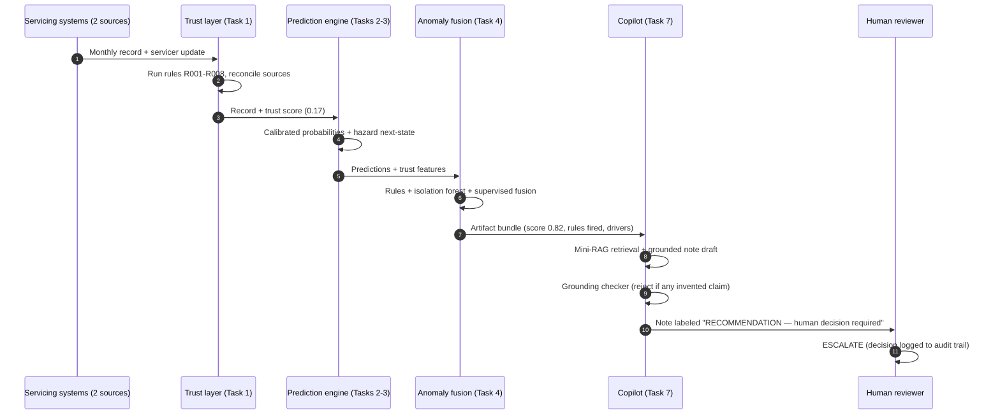
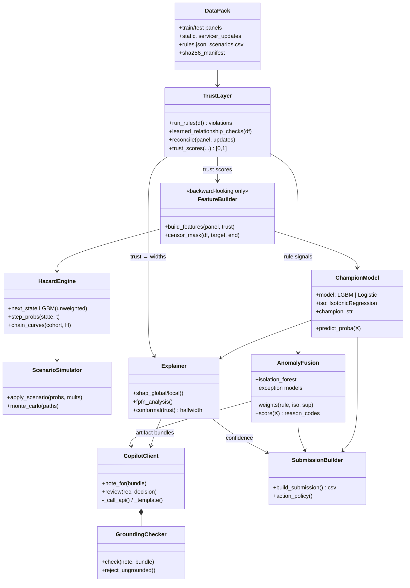

# The Solution Story — Loan Performance Intelligence Engine
*A 0-to-legend explanation: what problem we solve, how, and why our approach wins.
All diagrams provided in **Mermaid** (renders natively on GitHub) and **PlantUML**
(for docs tooling / plantuml.com).*

---

## Level 0 — For anyone (the 60-second version)

Imagine a bank receives a monthly report card for 9,000 home loans. The report
cards arrive messy: some numbers are wrong, some pages are duplicated, two
different offices sometimes report different balances for the same loan, and some
reports are months stale.

Our engine does four things a great analyst would do — at machine speed:
1. **Grades the report cards themselves** — can this record even be trusted?
2. **Predicts trouble early** — which loans will miss payments, default, or pay off early?
3. **Runs "what-if" storms** — what happens to the whole portfolio if the economy sours?
4. **Explains everything in plain language** — with an AI assistant that is only
   allowed to describe facts we computed, never to invent.

The one idea that ties it together: **if the data is shaky, our confidence must
shrink.** A prediction from a suspicious record comes with an honest, wider
uncertainty range and a human-review flag — never false confidence.

---

## Level 1 — For business stakeholders (why this is different)

**The problem most systems have:** data cleaning, prediction, and reporting are
separate silos. A record can fail a quality check in one system while another
system confidently prices it. Wrong-but-confident is the most expensive failure
mode in lending.

**Our difference — the Trust Engine design:** every record gets a **trust score
at ingestion** (rule violations, source conflicts, staleness), and that score
*travels* with the record through everything downstream:

| Where trust flows | What it changes |
|---|---|
| Model features | Models learn that shaky records behave differently |
| Anomaly scoring | Low trust + statistical oddity + rule hits = escalation |
| Prediction confidence | Uncertainty intervals **widen** as trust falls (verified ≥90% coverage) |
| Review routing | AUTO_ACCEPT / REVIEW / ESCALATE decided per record |
| AI assistant | The copilot must cite computed facts; ungrounded claims are auto-rejected |

**A real scenario, end to end** (this exact case exists in our outputs — see
`reports/anomaly_examples.md`, Example 2): loan LN100171 is reported as *Current*
by the servicing system — but shows 111 days past due, a conflicting servicer
update, and a document gap. A traditional pipeline prices it as a healthy loan.
Ours drops its trust to 0.17, fuses four independent signals into a 0.82 anomaly
score, widens its prediction interval, routes it to ESCALATE, and hands the
reviewer an AI-drafted note where every sentence traces to a computed artifact.

### The record's journey (sequence diagram)

**Mermaid:**


**PlantUML:**


---

## Level 2 — For analysts (how the predictions actually work)

A loan's life is a **state machine**: it is Current, slips to 30/60/90 days past
due, and either cures back, defaults, or prepays. Default and prepayment are
**competing exits** — a loan that pays off early can never default. Our monthly
panel is literally one row per loan per month, so predicting "next month's state"
IS a survival model in discrete time: chain the monthly probabilities and you get
12-month default and prepayment curves. Shock those monthly probabilities with
macro multipliers and you get stress scenarios where trouble **compounds**
month over month — the way real stress works.

### The loan state machine

**Mermaid:**
```mermaid
stateDiagram-v2
    [*] --> CURRENT : origination
    CURRENT --> DPD30 : misses payment
    DPD30 --> DPD60 : deteriorates
    DPD60 --> DPD90 : deteriorates
    DPD30 --> CURRENT : cures
    DPD60 --> CURRENT : cures
    DPD90 --> DPD60 : partial cure
    DPD90 --> DEFAULT : charge-off
    CURRENT --> PREPAID : refinances / pays off
    DEFAULT --> [*]
    PREPAID --> [*]
    note right of DEFAULT : absorbing —\ncompeting risk vs PREPAID
```

**PlantUML:**


**Three analyst-level proof points** (full evidence in `reports/`):
- Validation is **out-of-time AND out-of-loan** (no loan appears in both sets —
  asserted in code) with a label-permutation test at AUC 0.48 ruling out leakage.
- Calibration means our probabilities are *honest*: when we say 10%, roughly 10
  in 100 such loans actually experience the event (reliability curves included).
- We report the finding most teams would hide: for prepayment, a simple linear
  model beats gradient boosting because trees can't extrapolate refinance
  incentive across interest-rate regimes. We ship the model that generalizes.

---

## Level 3 — For engineers (the system, as classes)

The codebase is functional Python organized by pipeline stage; the class diagram
below is the honest conceptual model of those components and their contracts.

**Mermaid:**


**PlantUML:**


---

## Level Legend — the claims and their receipts

Every claim above is backed by a measured artifact in this repo, not a slide:

| Claim | Receipt |
|---|---|
| "We catch bad records" | 99.5-100% recall per corruption type vs **hidden ground truth**; 100% high-severity precision (`reports/data_intelligence_report.md` §7) |
| "Predictions are honest" | Calibration improves Brier on every target; reliability figures; permutation test 0.483 (`reports/model_performance.md`) |
| "Curves match reality" | Simulated 12m default 8.3% vs 6.3% observed, monotone by credit band (`reports/transition_model_report.md`) |
| "Stress compounds properly" | Adverse 15.0% vs base 8.3%; MC 90% band 13.8-16.3% brackets the estimate (`reports/scenario_report.md`) |
| "Uncertainty respects trust" | Interval halfwidths LOW 0.126 > MED 0.114 > HIGH 0.095, coverage ≥ 90% in every band, flat-empirics disclosed (`reports/explainability_report.md`) |
| "The AI cannot invent" | Live rejection: model called 0.03 "relatively high" and invented "3%" — auto-rejected by the grounding checker (`logs/reviewed_outputs.jsonl`) |
| "Anyone can reproduce this" | `python run_all.py` — data to submission.csv in ~5 minutes, Dockerfile included |
| "The build itself was governed" | AI Development Log with 9+ documented rejected/corrected AI outputs (`logs/AI_DEVELOPMENT_LOG.md`) |

**The philosophy in one line, from problem to product:** messy data is not an
obstacle to remove before the "real" system starts — it is a signal the real
system must carry, price, and disclose. That is what a trust engine means.
