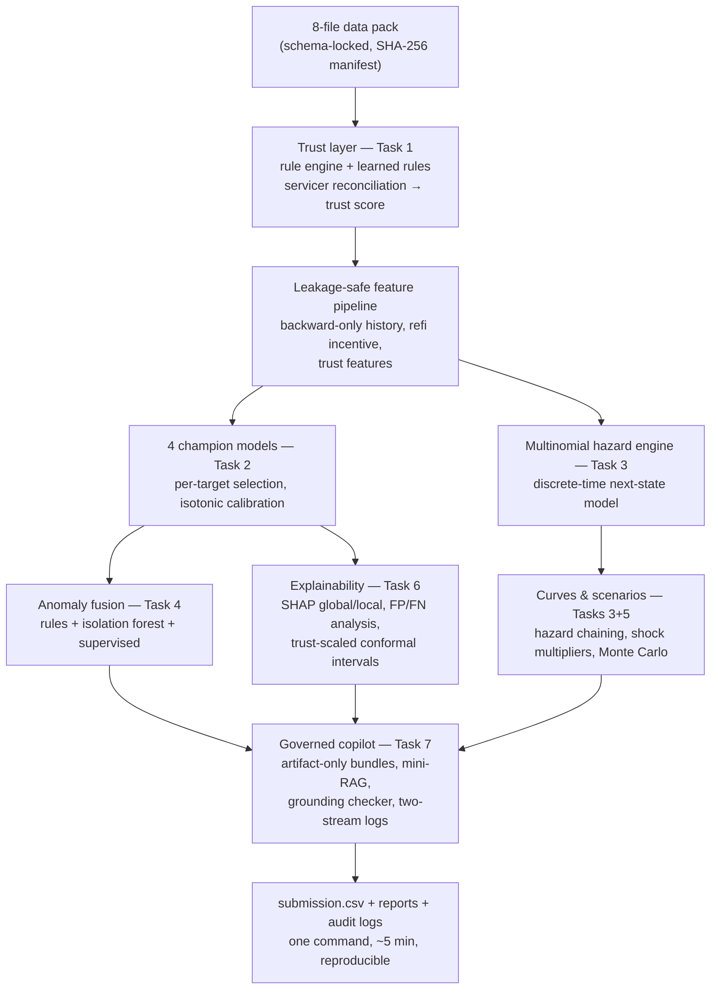

# Architecture — Loan Performance Intelligence Engine

## The problem, restated as an engineering goal
Given messy monthly loan-level data from imperfect sources: (1) identify which
records can be trusted, (2) predict which loans deteriorate, prepay, or default,
(3) show what the portfolio looks like under stress, and (4) explain every output
to a human reviewer — with an LLM that assists but never decides.

## The core idea (one sentence)
**Data quality is a first-class signal**: a per-record trust score is computed at
ingestion and propagates through the entire engine — into model features, anomaly
fusion, conformal interval widths, copilot bundles, and the submission's
`confidence` column — so unreliable data can never produce confident predictions.

## End-to-end flow

## Decision log — what we chose, what we rejected, and why

| # | Decision | Alternatives rejected | Why |
|---|----------|----------------------|-----|
| 1 | **Schema-locked synthetic data pack with hidden ground truth** (organizer pack pending; support ticket raised Aug 27, escalation confirmed) | Raw Fannie/Freddie downloads | Section 5 says students shouldn't need data-portal registration; license violation is a DQ condition; real data can't provide exception labels, a conflicting second source, or verifiable anomaly ground truth. Hidden ground truth makes detector quality *measured* (99.5-100% recall), not asserted. Official pack drops into `data/raw/` with zero code changes. |
| 2 | **Trust score at ingestion, propagated everywhere** | Treating profiling as a standalone report | The challenge is titled "Build the Trust Engine". A quality score that no downstream component consumes is theater; ours changes features, anomaly scores, interval widths, review routing, and submission confidence. |
| 3 | **Out-of-time AND out-of-loan split** (disjoint loan groups + temporal cutoff, overlap asserted = 0) | Plain temporal split; random split | Random splits leak loans (explicit DQ condition). Plain temporal splits still let the same loan appear on both sides. Doing both is the strictest defensible reading, verified by a 3-seed label-permutation test (mean AUC 0.483). |
| 4 | **Strict horizon censoring** (rows with unobserved forward horizons dropped entirely) | Keeping event=1 rows from partial horizons | Keeping observed events from incomplete horizons biases positive rates upward. Dropping both classes is unbiased. |
| 5 | **LightGBM as default, per-target champion selection on validation AUC** | Deep learning; one-model ideology | GBMs are state of the art for tabular data at this size and SHAP-explainable (30/100 rubric points are explanation-adjacent). Champion selection surfaced a real finding: the logistic model wins prepayment because trees cannot extrapolate refinance incentive across rate regimes — complexity is not free under regime shift. |
| 6 | **Discrete-time multinomial hazard for Task 3** | Cox PH (lifelines); Fine-Gray | The monthly panel IS person-period data: next-state probabilities are exactly discrete-time hazards; chaining yields cumulative incidence. Competing risks live natively in one multinomial head; censoring is handled with zero imputation. One model powers Task 2's next-state target, Task 3's curves, and Task 5's scenarios. Trained WITHOUT class weighting: weighting inflated rare-state hazards and corrupted simulation (14.6% vs 6.3% observed default; unweighted: 8.3%). |
| 7 | **Scenario shocks applied to transition hazards, then propagated** | Point-multiplying output probabilities | Multiplying outputs by a fudge factor ignores dynamics. Scaling monthly hazards lets a delinquency shock compound into later defaults — CCAR-style stress logic. Monte Carlo bands validated to bracket the expected-value estimate (a designed consistency check that caught a real double-transition bug). |
| 8 | **Anomaly = rules + Isolation Forest + supervised fusion with reason codes** | Autoencoders; pure ML | The rubric asks for the rule/ML combination explicitly. Rules give auditable reason codes; the forest catches statistical outliers rules can't anticipate; the supervised model learns the residual mapping. Evaluated against hidden ground truth: recall@p90 = 0.956. |
| 9 | **Trust-scaled normalized conformal intervals as governance policy** | Claiming empirical widening that wasn't there | Plain per-band conformal produced flat halfwidths (injected corruptions are independent of hazards by construction). We disclose that finding and ship trust-scaled intervals as explicit policy — deliberately conservative on unreliable data — with per-band coverage verified ≥ 90% nominal. |
| 10 | **Dependency-free mini-RAG + grounding checker for the copilot** | LlamaIndex + FastAPI service | The retrieval corpus is ~3k tokens; a vector index is overkill that bloats the judges' install. Our retriever selects dictionary entries and rules for exactly the fields present and logs retrieved ids. The grounding checker extracts every number and rule-id from a note and rejects any claim not present in the artifact bundle — demonstrated live on real API outputs (the model editorialized 0.03 as "relatively high" and invented "3%"; auto-rejected). |
| 11 | **Two-stream JSONL logging + template fallback mode** | API-only copilot | prompt_log.jsonl (prompt, model, timestamp, artifact ids, retrieved ids, output, grounding verdict) + reviewed_outputs.jsonl (human decision + reason) = complete governance evidence. Template mode keeps the pipeline reproducible without secrets. |
| 12 | **One-command pipeline + Dockerfile + seeded RNG + SHA-256 manifest** | Notebook sprawl | `python run_all.py` regenerates everything, data to submission, in ~5 minutes. Reproducibility is 5 rubric points and a disqualification shield. |

## How the pieces answer the problem statement's core question
*"Which records are unreliable?"* → Task 1 trust scores + Task 4 fusion, with
measured recall against hidden ground truth and 24 reviewer-ready examples.
*"Which loans are likely to deteriorate?"* → four calibrated champions + the
hazard engine, validated out-of-time and out-of-loan.
*"What does the portfolio look like under scenarios?"* → hazard-propagated
base / adverse-credit / high-prepayment projections with segment impacts and MC bands.
*"Explain outputs to a human reviewer"* → SHAP + FP/FN analysis + trust-scaled
intervals, narrated by a copilot that is grounded, logged, labeled
recommendation-only, and rejected automatically when it invents.

## Failure modes we accept and disclose
Prepayment is the weakest target (rate-regime dependence — linear champion shipped).
Forward simulation over-projects mildly (~2pp) due to representative-feature aging.
Synthetic absolute levels are generator-chosen; shapes and orderings are the claims.
All limitations live in docs/MODEL_CARD.md, not in fine print.
